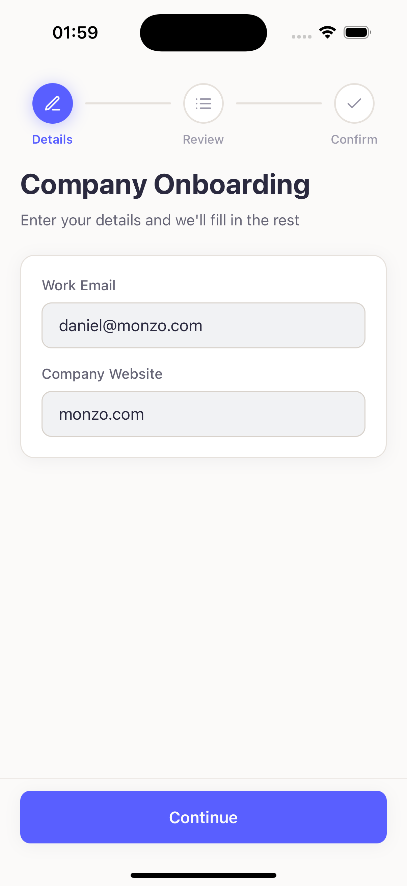
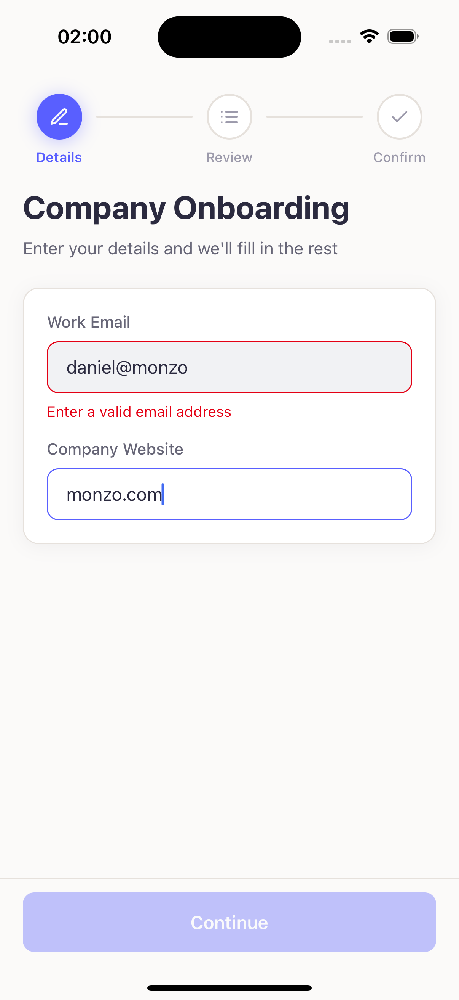
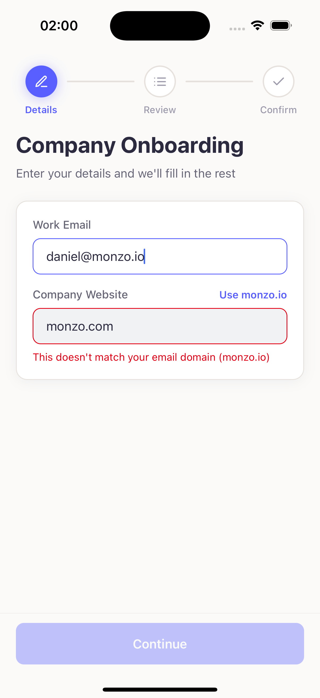
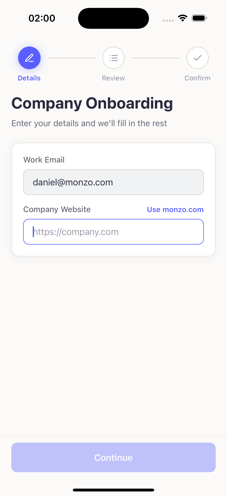
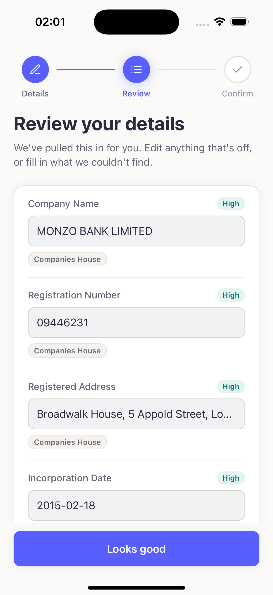
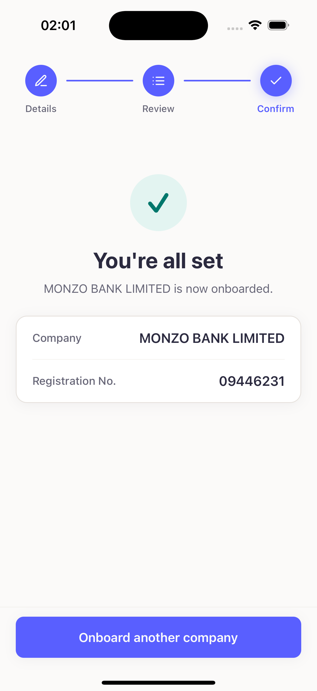

# Company Enrichment Onboarding

Minimise onboarding friction: the user provides only a **work email** and a
**company website**, and the app auto-fills the rest of the company record by
enriching from external sources — showing the **source and confidence for every
field**, and letting the user correct anything before confirming.

A monorepo with two halves that share one TypeScript contract:

- **`backend/`** — Node / Express / TypeScript. A `POST /enrich` endpoint that
  resolves the fuzzy identity (a domain/brand) to a canonical company record.
- **`mobile/`** — Expo / React Native / TypeScript. A three-step wizard
  (Details → Review → Confirm) that survives being backgrounded or killed.

---

## Screenshots

| Details | Email validation | Domain match |
| :--: | :--: | :--: |
|  |  |  |
| Just an email and a website to start. | Inline email-format validation. | Flags a website that doesn't match the email's domain. |

| Autofill | Review | Confirm |
| :--: | :--: | :--: |
|  |  |  |
| One-tap autofill of the domain from the email. | Every field with its **source** and colour-coded **confidence**, all editable. | Success state with a short company summary. |

---

## Features

**Enrichment (backend)**

- **`POST /enrich`** takes `{ email, website }` and returns a structured
  `company` record plus an `enrichment` block (per-field **confidence**,
  per-field **source/provenance**, and human-readable **warnings**).
- **Three data sources**, run as a **cost-aware cascade** (details below):
  Companies House → website scrape → Claude.
- **Graceful degradation** — a source that's down, rate-limited, or can't find a
  match returns a warning instead of throwing, so the request always succeeds.
- **Confidence per field** derived from how well the search result matches the
  name seed extracted from the domain/email.

**Onboarding (mobile)**

- **Progress stepper** with per-stage icons; completed stages are tappable for
  **back/forward navigation**.
- **Input validation** — basic email format, plus a check that the website's
  domain matches the email's domain, with a one-tap **"Use `<domain>`"**
  autofill.
- **Non-blocking enrichment** — the form stays editable while the lookup runs.
- **Editable Review** — every field is an input showing its **source pill** and
  a **colour-coded confidence pill** (green / amber / red). Fields we couldn't
  find show a **"Not found"** pill with manual entry; editing any field flips it
  to a high-confidence *User Input* value.
- **Two loading states** — a non-blocking banner during enrichment, and a
  "Saving…" state (mock save) before the confirmation screen.
- **Survives background / kill** — the whole flow is persisted; close the app on
  Review and it reopens on Review with your edits intact.
- **Never dead-ended** — a network error offers **"Enter details manually"**,
  routing to an empty, fully-editable Review.

**Quality**

- **Unit tests** on both halves (Vitest) and a **GitHub Actions** workflow that
  runs them on every PR and posts a **results table** as a PR comment.

---

## Running it locally

### Prerequisites

- **Node 20+** and npm
- **Xcode** (for the iOS Simulator) and/or **Android Studio** (for an emulator)
- **Expo Go** on a physical device (optional)
- API keys (see [Environment](#environment))

### Install

```bash
npm run install:all   # installs root, backend, and mobile deps
```

### Environment

```bash
cp backend/.env.example backend/.env
```

Then set in `backend/.env`:

| Variable | Notes |
| --- | --- |
| `COMPANIES_HOUSE_API_KEY` | From the [CH developer hub](https://developer.company-information.service.gov.uk). **Register a _Live_ application** — a _Test_ key only works against the sandbox. |
| `CLAUDE_API_KEY` | Anthropic API key (used for the last-resort LLM field inference). |
| `COMPANIES_HOUSE_API_BASE` | *Optional.* Defaults to the live host; point at the sandbox if using a test key. |

The mobile app auto-discovers the backend URL from Expo (works on Simulator,
emulator, and LAN). Override with `EXPO_PUBLIC_API_URL` if needed.

### Run

```bash
npm run dev        # backend (:3001) + Expo, together
# or target one platform:
npm run dev:ios
npm run dev:android
```

With Expo running, press **`i`** (iOS Simulator) or **`a`** (Android emulator),
or scan the QR code with **Expo Go** on a physical device.

### Tested on

- **Physical iPhone 16 Pro (iOS 26)** via Expo Go
- **iPhone 16 Simulator (iOS 18)**
- **Pixel 10 Pro emulator (Android 17)**

### Tests

```bash
npm test           # runs both suites
```

---

## Data sources & why

The interesting problem is that the input is an email and a website — **not** a
registration number — so the backend hinges on resolving a fuzzy identity to a
canonical record. Everything downstream (which fields we trust, what confidence
we report) flows from how sure we are we found the right company.

| Source | Role | Why | Confidence |
| --- | --- | --- | --- |
| **Companies House** (UK Public Data API) | Authoritative | The official register — hard facts: legal name, registration number, registered address, incorporation date, company type, status, and an industry bucket from the SIC code. | Driven by the name-match score |
| **Company website** (scrape) | Self-reported | Free fallback when CH can't confidently match — `og:site_name` / JSON-LD for name & address, footer regex for a UK company number. | Conservative (self-reported) |
| **Claude** (Anthropic, `claude-haiku-4-5`) | Soft fields only | Infers **industry** and a cleaned trade name from text already scraped off the site. The prompt forbids inventing hard facts (numbers, addresses, dates) and prefers `null` over a guess. | Low (inference) |

**Why a cascade, not a concurrent merge?** The sources run **in priority order
and stop as soon as one confidently resolves the company**: Companies House is
free and authoritative, the website scrape is free, and the LLM costs money — so
the cascade keeps paid calls to a minimum (the LLM only runs when the cheaper
sources fall short). The trade-off is that we give up cross-source
*corroboration* (agreement bumping confidence); that's an acceptable price for
lower cost and latency, and re-introducing it is a listed improvement.

Every source is an **isolated adapter behind a common return type** with an
**injected `fetch`**, so each is swappable and unit-testable with a stub — no
live keys needed to prove the logic. The merge step is a **pure function** (no
I/O), fully testable offline.

---

## Mobile trade-offs

**State persistence.** The whole `OnboardingState` is one serialisable object in
a `useReducer` at the root, shared via Context. Because every change is an
explicit action, persistence falls out for free: a debounced autosave to
`AsyncStorage` on every change, plus an **immediate flush on `AppState`
background** (the debounce timer may not fire before the OS suspends the
process), **hydration before first paint**, and a **schema-versioned key** so a
future shape migrates rather than crashes. A transient "enriching" status is
reset and re-run on resume, so a kill mid-lookup resumes cleanly rather than
restoring a spinner that never resolves. Closing the app on Review reopens on
Review with edits intact; confirming clears the key.

**Keyboard handling & button placement.** The primary action is **pinned to the
bottom of the screen** in a footer bar — the natural, thumb-reachable press zone
on a phone, where a call-to-action belongs. But a bottom button and an on-screen
keyboard normally fight for the same space, so the footer is wrapped in a
`KeyboardAvoidingView`: when the keyboard opens, the button **rides up and sits
just above it** (iOS `padding`; on Android the window's `adjustResize` handles
it), while the content scrolls independently underneath. The result is a CTA
that's both ergonomic *and* never obstructed while typing.

**Safe areas.** `SafeAreaProvider` + `SafeAreaView` (top and bottom insets) keep
content clear of the notch / Dynamic Island and the home indicator across
devices.

**Offline / failure.** Enrichment is non-blocking (the form stays usable with an
inline loading banner). Any failure is a **soft failure**: a network error
surfaces an **"Enter details manually"** action that drops the user into an
empty, fully-editable Review with a warning — so onboarding can always be
completed by hand. Combined with persistence, an interrupted session is never
lost.

**Navigation library choice.** The flow is driven by a **`step` enum in state**
(`input → review → confirm`) rather than `expo-router` or React Navigation. For
a linear, three-step flow with no deep-linking, that's less machinery and makes
persistence trivial — the entire flow is one serialisable object. The tappable
stepper provides back/forward. A navigation library would earn its place only if
the flow branched, needed deep links, or wanted native screen transitions.

---

## Testing & CI

- **Backend (Vitest):** the input normaliser, the pure merge engine, and each
  source (Companies House matching/mapping/error-handling, website extraction,
  LLM parsing) — all with injected `fetch`/completion stubs.
- **Mobile (Vitest):** input validation, the reducer (every action), the
  response-to-fields mapper, and the persistence layer against a mocked
  `AsyncStorage`.
- **CI (`.github/workflows/ci.yml`):** on every PR to `main`, typecheck and test
  both packages, then post a **sticky PR comment** with a results table split by
  Backend / Mobile plus a collapsible per-test breakdown.

---

## Future Improvements

- **Website corroboration for confidence** — cross-check the Companies House
  match against the site's self-reported name and only report *high* when they
  agree (the strongest signal; currently skipped by the cost-saving cascade).
- **Smarter confidence scoring** — the current score is name-token coverage;
  a symmetric similarity plus ambiguity and company-status awareness would stop
  over-confident matches on common/generic names.
- **A real `POST /companies` save endpoint** — persist the confirmed record for
  the confirmation flow (currently mocked client-side).
- **Finer industry mapping** — the SIC → industry bucket is coarse.
- **Shared contract as a workspace package** — today the mobile app imports the
  backend's `types.ts` via a `@shared` path alias (erased at build since it's
  type-only); a proper shared package would be cleaner.
- **More tests** — component/integration tests for the screens and an E2E pass.
- **Multi-agent orchestration** for the monorepo setup — a dedicated backend
  agent and a mobile agent.
- **Richer data-entry types** — date pickers, dropdowns, etc.
- **Loading-state animations.**
- **Haptic feedback** for improved UX.
- **Accessibility & landscape** support.
- **Dark mode.**
- **Validation on required fields.**

---

## AI tools used

This project was built with the **Claude Code CLI** (Anthropic's agentic coding
tool) running inside **VS Code**. It helped scaffold and iterate on the
enrichment cascade and its sources, the mobile state machine and persistence
layer, the test suites, and the CI workflow — verifying UI changes against live
iOS Simulator / Android emulator screenshots throughout. The enrichment
pipeline's LLM leg itself calls **Claude Haiku 4.5** for soft-field inference.
